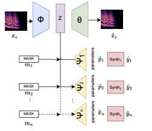

# Multi Task Automatic-Synthesizer-Programming
This is the code for the multi VST automatic synthesizer programming project. this software was use in the 2023 ICASSP paper **Exploring Approaches to Multi-Task Automatic Synthesizer Programming**.

## File Structure

The `data` folder contains scripts for generating data and encoding data to proper format

The `data generation` folder contains VSTs used for data generation (they only run on mac) and scripts for generating audio and viewing parameters.

The `experiments` folder cotains scripts for running statistical experiments using the model as seen in the paper.

## Training a model

To train a model, first clone this repository with

`git clone https://github.com/dafaronbi/Multi-Task-Automatic-Synthesizer-Programming.git`

Next, open the repository and make a directory for the data with 

`cd Multi\ Task\ Automatic-Synthesizer-Programming`

`mkdir npy_data`

Download the data needed for training and testing from [here](https://zenodo.org/record/7686668#.ZAET5ezMJhE) and place in `npy_data` folder

Make new environment and install dependencies. Here we use venv but you may use conda if you wish.

`python -m venv <env name>`

`source <env name>/bin/activate`

`pip install -r requirements.txt`

Train one of the models

`python train_multi.py`

`python train_single.py`

`python train_serum.py`

`python train_diva.py`

`python train_tyrell.py`

For the multi-vst model you can change the latent space size with 

`python train_multi.py -l <latent_size>`

For all models you can change the location of the data with

`python <train_script.py> -d <data directory>`

## Running inference on a saved model

To run a model, you must have models trained and saved in the folder `saved_models`. If you trained all models, these will be `vae_multi_<l>` where `<l>` is the latent size, vae_single, vae_serum, vae_diva, and vae_tyrell in the `saved_models` folder.

To run inference, use the script

`python run_inference.py`

This will select a random index in the test set stored in `npy_data`, runs the spectrogram through the multi-decoder model, and generates audio using the ground truth parameter and the infered parameters. You can change parameters for the inference by running

`python run_inference.py -md <model_dir> -dd <data_dir> -m <model> -s <sample> -l <latent_size>`

where `<model_dir>` is the directory for trained models (default is "saved_models),

`<data_dir>` is the directory for npy data used to read the test set (default is "npy_data"),

`<model>` is the model used for inference out of [multi, single, serum, diva, tyrell] (default is "multi"),

`<sample>` is the integer index of the test set to be selected (default is -1. This means a random sample will be selected),

and `<latent_size>` is the integer size of the latent dimmension if the multi-decoder model is selected

## Issues

Please send an email to danielfaronbi@nyu.edu if you have any questions about how it works.

